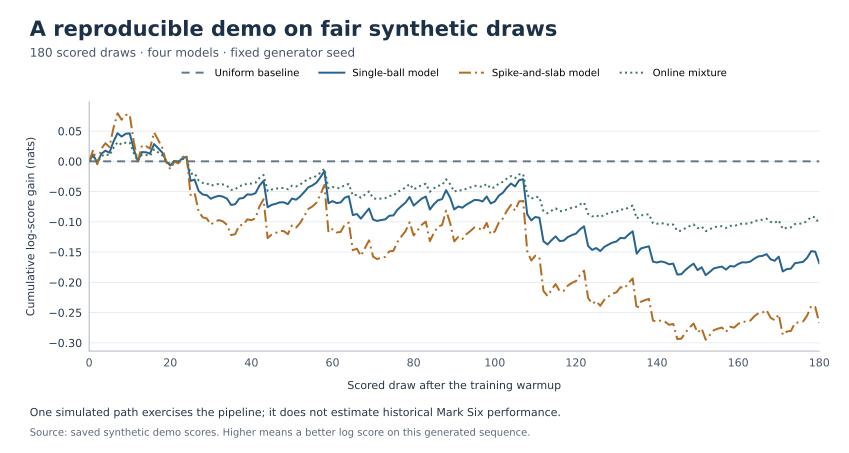
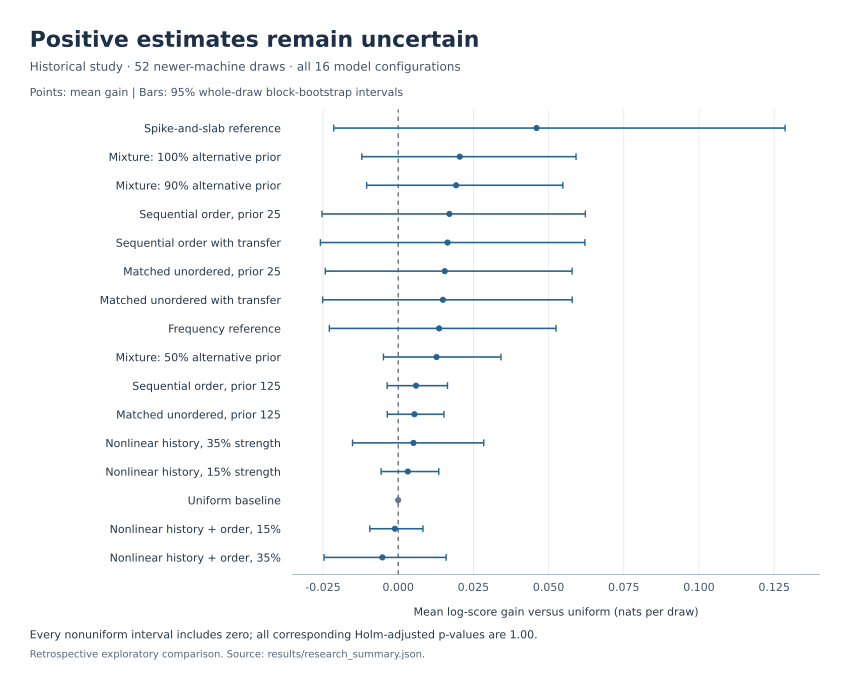

# Mark Six: probabilistic modeling and model validation

Forecasting Mark Six draws (Hong Kong's 6-of-49 lottery): unordered sets of six distinct numbers from 49, using sparse Bayesian models and chronological evaluation against a uniform baseline.

The implementation covers exact set probabilities, inclusion marginals, online model averaging, regime resets, and uncertainty estimates. The included example uses synthetic fair draws. A separate historical comparison covers 16 model configurations over 1,075 draws; it did not establish a predictive edge.

## Run

Requires Python 3.10 or newer.

```sh
python3 -m venv .venv
source .venv/bin/activate
python3 -m pip install -e '.[test]'
python3 -m pytest
python3 -m marksix demo --output results/my-run
```

The default example generates 240 independent fair draws with seed `20260914` and scores the last 180 after a 60-draw warmup. The [reference input](results/demo/synthetic_draws.csv) uses artificial daily dates starting on 1 January 2000. Each run saves the input checksum, source hashes, package versions, model settings, summary statistics, and per-draw scores. Demo runs also save their generated input. Existing output directories are rejected.



The [reference summary](results/demo/summary.json) and [scores](results/demo/scores.csv) contain the plotted values. On fair draws no model can beat the uniform baseline in expectation, so the slightly negative totals here are the expected control result; `tests/test_evaluation.py` checks that the same evaluator does detect a planted signal.

Evaluate another CSV:

```sh
python3 -m marksix evaluate --input path/to/draws.csv --output results/custom --warmup 60
```

Required columns are `date`, `draw_id`, and `n1` through `n6`. Dates must be unique, strictly increasing `YYYY-MM-DD` values; IDs must be nonempty and unique. Each outcome must contain six distinct integers from 1 to 49. An optional populated `extra` column must contain a seventh distinct number; it does not enter the main-set forecast score.

An optional `--reset-date YYYY-MM-DD` clears training history and mixture weights at the first draw on or after a predetermined regime boundary. Warmup applies once, at the beginning of the dataset. A reset can therefore produce a forecast from the prior alone.

## Models

| Model | Method |
|---|---|
| `uniform` | Equal probability for each of the 13,983,816 six-number sets. |
| `sparse_single_ball` | Bayesian averaging over a uniform null and 49 mutually exclusive single-ball bias hypotheses. |
| `spike_slab` | Per-ball shrinkage toward the fair inclusion probability, with a sparse alternative prior. |
| `online_mixture` | Arithmetic probability mixture of the three models above, weighted by earlier scores. |

The beta alternatives are centered at `6/49` with concentration 20. The single-ball model splits prior mass equally between the uniform null and all alternatives together. The spike-and-slab prior assigns bias probability `1/49` to each ball. These are fixed statistical assumptions, not measured physical properties.

Propensities are clipped to `[0.015, 0.60]` and converted to log odds `z`. Each component is then evaluated as a conditional-Poisson distribution:

```text
P(S | z) = exp(sum(z[i] for i in S)) / Z(z),  |S| = 6
Z(z) = sum over six-element sets A of exp(sum(z[i] for i in A))
```

Dynamic programming computes the normalizer and marginals in log space. Marginals sum to six. Conditioning on set size changes the input propensity moments: this conversion is a projection. The spike-and-slab updates also use a composite approximation because ball indicators within a draw are dependent.

The mixture starts with weights `[0.5, 0.25, 0.25]`. It combines component probabilities, then updates weights **after** scoring the outcome, with learning rate `0.25` and a `1%` blend back to the initial prior. All component forecasts use preceding draws only.

## Evaluation

Log-score gain is `log P_model(observed set) - log P_uniform(observed set)`, measured in nats. Positive gain means a better score on the evaluated outcomes; it is not a cash return. Brier gain measures reduction in mean squared error across the 49 inclusion probabilities.

The evaluator uses 2,000 circular block-bootstrap resamples with eight-draw blocks. Entire draws are resampled together across models. Confidence intervals describe mean gain per draw; Holm adjustment covers the three nonuniform forecasts. For fewer than 32 evaluated draws, nonbaseline confidence intervals and p-values are omitted.

Chronological fitting prevents target leakage within an evaluation. It does not correct model selection informed by the evaluation period. Bootstrap summaries also depend on assumptions about temporal dependence and stationarity, especially around regime changes.

## Historical comparison

The [historical aggregate results](results/research_summary.json) cover 843 development draws, 180 subsequent old-machine draws, and 52 newer-machine draws through 10 September 2026. The last period begins on 5 May 2026. All outcomes were available before this model round was designed, so this comparison is retrospective.



The strongest newer-machine point estimate was the spike-and-slab reference: **+2.392 total nats**, or **+0.0460 nats per draw**, with a 95% mean interval of **[-0.0214, +0.1286]**. Every nonuniform newer-machine interval includes zero, and all corresponding Holm-adjusted p-values are 1.00. The historical intervals use 3,000 circular block resamples, with five-draw blocks for windows below 100 draws and 20 otherwise. Corrections cover the 15 nonuniform models within each period, not the complete earlier exploratory search.

These aggregates use a broader experimental suite and historical inputs that are not included here. The four-model synthetic example does not reproduce that study. The aggregate file records its source checksum and unrounded metrics. Statistical fit alone does not identify a physical mechanism, and the results remain inconclusive.

## Figures and source

Regenerate both figures from saved results:

```sh
python3 -m pip install -e '.[plots]'
python3 scripts/render_figures.py
```

```text
src/marksix/       Probability models, input validation, evaluation, and CLI
tests/            Probability identities, numerical checks, and leakage tests
scripts/          Figure generation
results/          Synthetic reference run and historical aggregates
```
